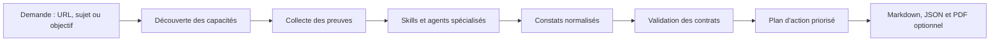

> **Langue :** Français | [English](README.md)


# Powehi Universal SEO

**SEO, AI Search & GEO Intelligence — un système fondé sur les preuves pour les agents.**

Powehi Universal SEO est une boîte à outils open source et multiplateforme pour
auditer, comprendre et améliorer la visibilité dans les moteurs de recherche.
Elle réunit des instructions d’agents portables, des outils Python déterministes
et des connecteurs de données optionnels dans un même processus : identifier ce
qui peut être mesuré, recueillir les preuves, déléguer l’analyse, valider chaque
constat et produire un plan d’action.

La distribution actuelle comprend **33 skills portables**, **18 agents spécialisés**,
**56 outils Python** et **8 extensions de données optionnelles**.

Le terme « Universal » décrit le modèle de fonctionnement : un même système pour
plusieurs environnements d’agents, sources de données, types de sites et surfaces
de recherche. Le GEO reste une capacité explicite consacrée à la recherche
générative et à la citabilité ; il ne constitue pas une discipline séparée du SEO
technique, de la qualité éditoriale et de l’autorité.

[](https://github.com/powehi-eu/powehi-seo-geo-universal/actions/workflows/ci.yml)
[](https://github.com/powehi-eu/powehi-seo-geo-universal/releases/tag/v2.2.12)
[](LICENSE)
[](https://powehi.eu)

## Pourquoi Powehi existe

Les audits SEO répartissent souvent une même question entre crawlers, tableaux
de bord, feuilles de calcul, clients API et prompts génériques. Powehi apporte la
couche de raisonnement qui relie ces outils sans supposer que chaque environnement
dispose des mêmes données.

Le produit repose sur six principes :

1. **Les preuves précèdent le score.** Un constat précise ce qui a été observé et comment.
2. **Les capacités sont vérifiées avant l’exécution.** Les connecteurs et fallbacks locaux sont testés avant le routage de l’audit.
3. **Source, build et production sont des états distincts.** Ils ne sont jamais confondus silencieusement.
4. **La dégradation est explicite.** Une donnée indisponible produit un statut documenté, jamais une valeur inventée.
5. **Les constats sont réfutables.** Chaque recommandation possède un moyen de vérification.
6. **Les livrables font partie du résultat.** L’audit n’est terminé qu’après validation des fichiers Markdown et JSON attendus.

## Fonctionnement




### 1. Découvrir les capacités

Avant tout audit complet, Powehi vérifie séparément GSC, GA4, CrUX,
PageSpeed et les sources de backlinks. Les outils natifs et connecteurs MCP sont
évalués avant les credentials locaux. La disponibilité, l’authentification,
l’accès à la cible et la raison expurgée d’un échec sont enregistrés dans
`capability-discovery.json`.

### 2. Recueillir les preuves disponibles

Le système peut examiner le HTTP brut, les pages rendues, l’accessibilité, les
sitemaps, les données structurées, les performances et les données de recherche
authentifiées. Chaque résultat conserve sa source, son type de preuve, sa fraîcheur
et son statut terminal.

### 3. Orchestrer les spécialistes

L’orchestrateur `powehi-seo` ne charge que les skills adaptés à la cible et à son
secteur. Un audit complet peut mobiliser les spécialistes technique, contenu,
schema, performance, visuel, sitemap, Google, backlinks et AI Search.

### 4. Normaliser et valider

Les résultats convergent vers un contrat stable. Les fichiers obligatoires et
les enregistrements structurés sont vérifiés ; une capacité indisponible reste
visible dans le rapport.

### 5. Prioriser les décisions

Les constats sont hiérarchisés selon leur impact, leur niveau de confiance, leurs
dépendances et leur effort. FLOW transforme ensuite les preuves en séquence de
recherche, d’autorité, d’optimisation, de conversion ou de croissance locale.

## Le modèle FLOW


| Étape | Question | Résultat attendu |
|---|---|---|
| **Find** | Où se trouve l’opportunité ? | Carte de la demande et des intentions |
| **Leverage** | Quels actifs peuvent être amplifiés ? | Plan d’autorité et de distribution |
| **Optimize** | Que faut-il améliorer maintenant ? | Actions techniques et éditoriales ciblées |
| **Win** | Comment transformer la visibilité en valeur ? | Plan de conversion et de mesure |
| **Local** | Qu’est-ce qui change pour une demande locale ? | Plan d’acquisition locale |

```text
/powehi-seo flow
/powehi-seo flow find "pompes à chaleur industrielles"
/powehi-seo flow leverage https://example.com
/powehi-seo flow optimize https://example.com/produit
/powehi-seo flow win https://example.com
/powehi-seo flow local https://example.com/lyon
```

La bibliothèque comprend 41 prompts FLOW spécialisés par Powehi : 5 Find,
1 Leverage, 21 Optimize, 3 Win et 11 Local. La synchronisation est contrôlée et
non destructive : un ensemble incomplet, générique ou dupliqué est rejeté.

Framework et prompts FLOW © Daniel Agrici, sous licence CC BY 4.0.

## Couverture fonctionnelle


| Domaine | Capacités principales |
|---|---|
| **Audit et technique** | Crawlabilité, rendu, canonicals, robots, sitemaps, Core Web Vitals |
| **Contenu et autorité** | E-E-A-T, briefs, clusters, backlinks, vérification et dérive |
| **Données structurées** | Détection, validation et génération Schema.org |
| **AI Search et GEO** | Citabilité, entités, visibilité IA et mentions de marque |
| **Expérience de recherche** | SXO, personas, contrôles visuels et conversion |
| **Modèles économiques** | SaaS, local, média, e-commerce et SEO programmatique |
| **International** | Hreflang, profils culturels et parité multilingue |
| **Plateformes** | Search Console, GA4, CrUX, PageSpeed, Bing et IndexNow |

## Installation rapide

### Plugin Claude Code

```text
/plugin marketplace add powehi-eu/powehi-seo-geo-universal
/plugin install powehi-universal-seo-geo@powehi-universal-seo-geo
```

### Plugin OpenClaw / ClawHub

```bash
openclaw plugins install clawhub:powehi-universal-seo-geo
openclaw plugins enable powehi-universal-seo-geo
openclaw gateway restart
```

### Hermes

```bash
hermes skills tap add powehi-eu/powehi-seo-geo-universal
hermes skills install powehi-eu/powehi-seo-geo-universal/skills/powehi-seo
```

Universal est un fork maintenu et une évolution Powehi de
[AgriciDaniel/claude-seo](https://github.com/AgriciDaniel/claude-seo), avec des
workflows GEO étendus, des contrôles de preuve, des garde-fous runtime et un
packaging multi-agents.

### macOS ou Linux

```bash
git clone --depth 1 https://github.com/powehi-eu/powehi-seo-geo-universal.git powehi-universal-seo
cd powehi-universal-seo
bash install.sh
```

### Windows

```powershell
git clone --depth 1 https://github.com/powehi-eu/powehi-seo-geo-universal.git powehi-universal-seo
Set-Location powehi-universal-seo
powershell -ExecutionPolicy Bypass -File .\install.ps1
```

### Premières commandes

```text
/powehi-seo audit https://example.com
/powehi-seo technical https://example.com
/powehi-seo content https://example.com
/powehi-seo schema https://example.com
/powehi-seo geo https://example.com
/powehi-seo google doctor
/powehi-seo backlinks https://example.com
```

Le cœur fonctionne sans API payante. `/powehi-seo setup` prépare le runtime
isolé et `/powehi-seo doctor` vérifie sa disponibilité.

## Contrat de sortie d’un audit

```text
example.com-audit/
├── capability-discovery.json
├── audit-data.json
├── executive-summary.md
├── action-plan.md
└── findings/
    ├── technical.md
    ├── content.md
    ├── schema.md
    ├── performance.md
    ├── google.md
    └── backlinks.md
```

`findings/google.md` et `findings/backlinks.md` sont obligatoires même lorsque
leurs connecteurs ne sont pas disponibles. `audit-data.json` conserve la cible,
le statut du run, les capacités et les constats normalisés.

## Architecture et compatibilité

```text
skills/                    Workflows et instructions portables
  powehi-seo/              Orchestrateur principal
  seo-audit/               Contrat d’audit et découverte des capacités
  seo-flow/                FLOW et bibliothèque de prompts
  seo-*/                   Workflows spécialisés
agents/                    18 définitions d’agents spécialisés
scripts/                   56 outils Python déterministes
bin/powehi-seo-geo         Entrée du runtime géré
extensions/                8 intégrations MCP optionnelles
tests/                     Tests de contrats, sécurité et portabilité
```

Identifiants techniques conservés pour compatibilité :

- commande utilisateur : `/powehi-seo` ;
- CLI système : `powehi-seo-geo` ;
- configuration : `~/.config/powehi-seo-geo/` ;
- identifiant du plugin : `powehi-universal-seo-geo` ;
- dépôt : `powehi-eu/powehi-seo-geo-universal`.

## Données et sécurité

- Aucune API payante n’est requise par le cœur.
- Les credentials Google sont optionnels et stockés dans
  `~/.config/powehi-seo-geo/` avec des permissions `0600`.
- Les credentials d’extensions (DataForSEO, Firecrawl, Ahrefs, SE Ranking,
  Profound, Bing Webmaster, Banana) sont écrits **en clair** dans
  `~/.claude/settings.json`, car c’est là que le runtime MCP les lit. Chaque
  installeur l’indique avant la saisie. Tout processus tournant sous votre
  compte, ainsi que tout outil de sauvegarde ou de synchronisation couvrant
  votre répertoire personnel, peut lire ce fichier : utilisez des credentials
  révocables chez le fournisseur.
- Les URLs sont contrôlées contre les risques SSRF et DNS rebinding. Aucune URL
  non publique (localhost, IP privées, noms d’hôtes internes, sous-domaines de
  préproduction, URLs portant un jeton ou un identifiant de session) n’est
  transmise à une API tierce.
- Les soumissions d’indexation (IndexNow, API Google Indexing) et toute étape de
  publication sont confirmées à chaque usage ; elles ne sont jamais enchaînées
  automatiquement à la suite d’une analyse.
- Un audit contacte les URLs ciblées et les fournisseurs explicitement activés.
- Les secrets et erreurs d’authentification non expurgées ne doivent jamais entrer dans les rapports.
- Les désinstalleurs ne suppriment que ce que l’installeur a enregistré dans son
  propre manifeste : une skill tierce partageant le préfixe `seo-` n’est jamais
  supprimée.

Voir [SECURITY.fr.md](SECURITY.fr.md) pour le modèle de menace et
[docs/SECURITY-AUDIT-RESPONSE.fr.md](docs/SECURITY-AUDIT-RESPONSE.fr.md) pour la
réponse à l’audit ClawHub de la v2.2.9.

## Limites

- Les très grands sites peuvent nécessiter un crawler spécialisé.
- La profondeur GSC, GA4, backlinks ou visibilité IA dépend des accès disponibles.
- Les applications dont le contenu apparaît après interaction peuvent demander une vérification visuelle.
- Le GEO ne contourne ni l’indexabilité, ni la pertinence, ni l’autorité.
- Les recommandations doivent être relues avant toute modification de production.

## Documentation

- [Installation](docs/INSTALLATION.fr.md)
- [Commandes](docs/COMMANDS.fr.md)
- [Architecture](docs/ARCHITECTURE.fr.md)
- [Compatibilité Codex](docs/CODEX-PLUGIN.fr.md)
- [Plugin OpenClaw et Hermes](docs/OPENCLAW-HERMES.md)
- [Connecteurs Google](docs/GOOGLE-MCP.fr.md)
- [Intégrations MCP](docs/MCP-INTEGRATION.fr.md)
- [Dépannage](docs/TROUBLESHOOTING.fr.md)
- [Synchronisation upstream](docs/UPSTREAM.fr.md)
- [Politique de sécurité](SECURITY.fr.md) et
  [réponse à l’audit](docs/SECURITY-AUDIT-RESPONSE.fr.md)
- [Contributeurs](CONTRIBUTORS.fr.md)

## Crédits et licence

Powehi Universal SEO est développé et distribué par
**[Powehi](https://powehi.eu)**. Les attributions upstream sont conservées dans
[docs/UPSTREAM.fr.md](docs/UPSTREAM.fr.md) et [CONTRIBUTORS.fr.md](CONTRIBUTORS.fr.md).

Le projet est distribué sous [licence MIT](LICENSE). Les prompts FLOW conservent
leur attribution distincte sous licence CC BY 4.0.

Les icônes de plateformes utilisées dans les illustrations proviennent de
[Simple Icons](https://simpleicons.org) (CC0 1.0). Les noms et logos
correspondants sont des marques déposées de leurs détenteurs respectifs ; ils
identifient les environnements pris en charge et n'impliquent ni approbation ni
affiliation.

---

**Powehi Universal SEO — des preuves aux décisions.**
