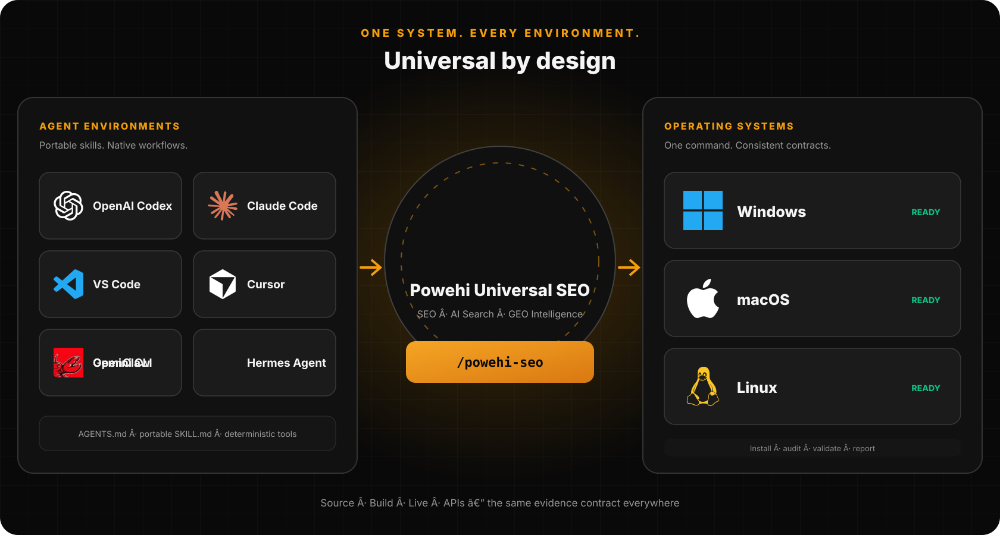
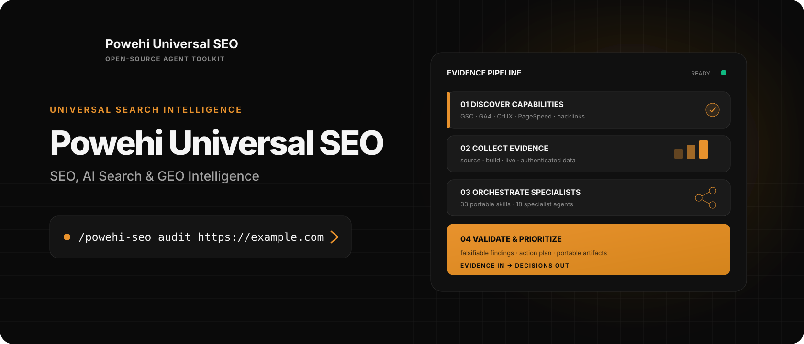
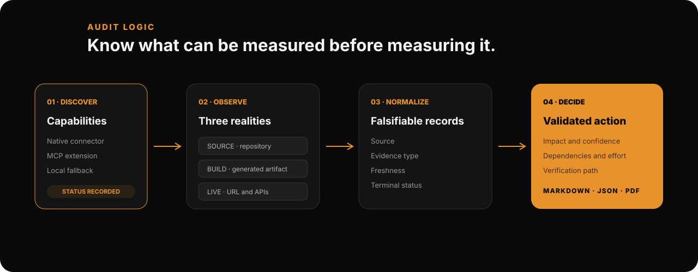
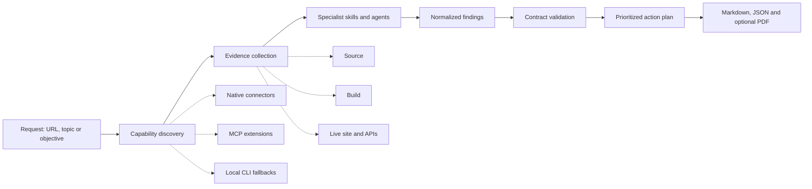
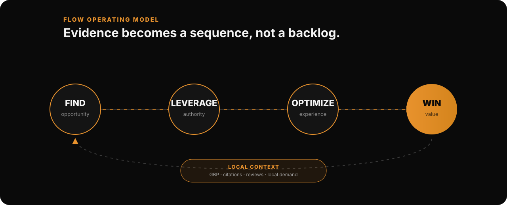
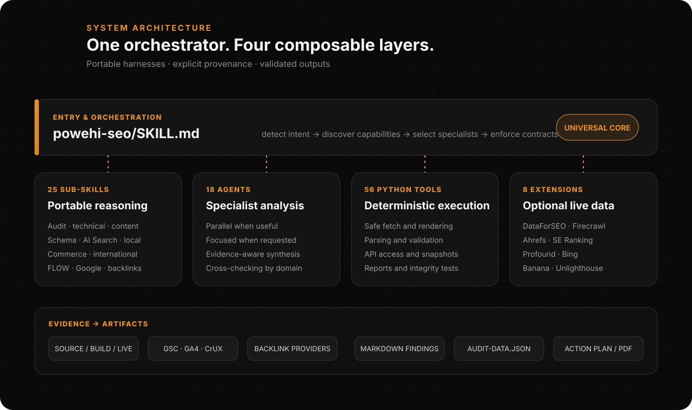

> **Languages:** [Français](README.fr.md) | English





# Powehi Universal SEO

**SEO, AI Search & GEO Intelligence — one evidence-led system for agents.**

Powehi Universal SEO is an open-source, cross-platform toolkit for auditing,
understanding and improving search performance. It combines portable agent
instructions, deterministic Python tools and optional data connectors in one
workflow: inspect what can be measured, collect evidence, delegate the analysis,
validate every finding and turn it into an actionable plan.

Its current distribution brings together **33 portable skills**, 18 specialist agents,
56 deterministic Python tools and 8 optional data extensions.

The core `skills/` tree contains **25 sub-skills**; the total portable skill
surface reaches 33 when extension mirrors are included.

“Universal” describes the operating model: one system across agent harnesses,
data sources, site types and search surfaces. GEO remains an explicit capability
for generative search and citation visibility; it is not treated as a separate
discipline disconnected from technical SEO, content quality and authority.

[](https://github.com/powehi-eu/powehi-seo-geo-universal/actions/workflows/ci.yml)
[](https://github.com/powehi-eu/powehi-seo-geo-universal/releases/tag/v2.2.9)
[](LICENSE)
[](https://powehi.eu)

## Why Powehi exists

Most SEO workflows split the same question across crawlers, dashboards,
spreadsheets, API clients and generic AI prompts. Powehi provides the reasoning
layer that connects them without pretending every environment has the same data.

It is designed around six principles:

1. **Evidence before scoring.** A finding must identify what was observed and how.
2. **Capabilities before execution.** Connectors and local fallbacks are tested
   before the audit is routed.
3. **Source, build and live are different states.** They are never silently
   collapsed into one conclusion.
4. **Graceful degradation is explicit.** Missing credentials produce a documented
   capability status, not invented data or a hidden omission.
5. **Findings must be falsifiable.** Recommendations include a verification path
   and can be challenged with new evidence.
6. **Artifacts are part of the result.** A full audit is not complete until its
   Markdown and structured data contracts validate.

## How the system works





### 1. Discover capabilities

Before a full audit starts, Powehi checks GSC, GA4, CrUX, PageSpeed and backlink
capabilities independently. Native tools and MCP connectors are considered before
local credential fallbacks. Availability, authentication, target access and the
exact redacted failure reason are recorded in `capability-discovery.json`.

### 2. Collect the best available evidence

The toolkit can inspect raw HTTP, rendered pages, accessibility data, sitemaps,
structured data, performance signals and authenticated search data. Each result
retains its source, evidence type, freshness and terminal status.

### 3. Route work to specialists

The main `seo` orchestrator selects only the skills relevant to the target and
industry. A full audit can dispatch technical, content, schema, performance,
visual, sitemap, Google, backlink and AI Search specialists while narrower
commands stay focused on one concern.

### 4. Normalize and validate

All findings converge into a stable audit envelope. Required files are checked,
structured records are validated and unavailable capabilities remain visible.
This makes the output usable by humans, automation and downstream report tools.

### 5. Decide what to do next

Powehi synthesizes findings by impact, confidence, dependency and effort. FLOW can
then turn the evidence into a research, authority, optimization, conversion or
local-growth sequence.

## The FLOW operating model



FLOW is the evidence-led strategy layer integrated into Powehi. It connects audit
signals to the next useful action instead of returning an undifferentiated list
of recommendations.

| Stage | Question | Typical evidence | Powehi outcome |
|---|---|---|---|
| **Find** | Where is the opportunity? | SERPs, queries, competitors, gaps | Demand map and search intent |
| **Leverage** | Which existing assets can compound? | Backlinks, mentions, authority | Authority and distribution plan |
| **Optimize** | What should be improved now? | Crawl, content, schema, UX, performance | Selected technical and editorial actions |
| **Win** | How does visibility become value? | BOFU pages, journeys, conversions | Conversion and measurement plan |
| **Local** | What changes for location-led demand? | GBP, citations, reviews, local SERPs | Local acquisition plan |

```bash
/powehi-seo flow
/powehi-seo flow find "industrial heat pumps"
/powehi-seo flow leverage https://example.com
/powehi-seo flow optimize https://example.com/product
/powehi-seo flow win https://example.com
/powehi-seo flow local https://example.com/lyon
```

The repository contains 41 Powehi-specialized FLOW prompts: 5 Find, 1 Leverage,
21 Optimize, 3 Win and 11 Local. Optimize deliberately selects the 2–3 prompts
that best match the current evidence rather than loading all 21.

FLOW framework and prompts © Daniel Agrici, licensed under CC BY 4.0. Attribution
is preserved in every FLOW activation. The synchronization process is
quality-gated and non-destructive: an incomplete, generic or duplicated upstream
set is rejected without replacing the curated local library.

## What Powehi covers



| Domain | Capabilities |
|---|---|
| **Audit and technical** | Full-site and page audits, crawlability, rendering, canonicals, robots, sitemaps, Core Web Vitals |
| **Content and authority** | E-E-A-T, briefs, topical clusters, backlinks, content verification, freshness and drift |
| **Structured data** | Schema detection, validation and generation, including local and commerce patterns |
| **AI Search and GEO** | Citability, entity coverage, AI visibility, brand mentions and generative-search readiness |
| **Search experience** | SXO, personas, user stories, visual checks and conversion surfaces |
| **Business models** | SaaS, local, publisher, e-commerce, programmatic SEO and competitor pages |
| **International** | Hreflang, cultural profiles and cross-language content parity |
| **Search platforms** | Google Search Console, GA4, CrUX, PageSpeed, Bing Webmaster and IndexNow |

## Quick start

### Claude Code plugin

```text
/plugin marketplace add powehi-eu/powehi-seo-geo-universal
/plugin install powehi-universal-seo-geo@powehi-universal-seo-geo
```

### Manual install on macOS or Linux

```bash
git clone --depth 1 https://github.com/powehi-eu/powehi-seo-geo-universal.git powehi-universal-seo
cd powehi-universal-seo
bash install.sh
```

### Manual install on Windows

```powershell
git clone --depth 1 https://github.com/powehi-eu/powehi-seo-geo-universal.git powehi-universal-seo
Set-Location powehi-universal-seo
powershell -ExecutionPolicy Bypass -File .\install.ps1
```

Then run a workflow from a compatible agent harness:

```text
/powehi-seo audit https://example.com
/powehi-seo technical https://example.com
/powehi-seo content https://example.com
/powehi-seo schema https://example.com
/powehi-seo geo https://example.com
/powehi-seo google doctor
/powehi-seo backlinks https://example.com
```

The core works without paid APIs. Use `/powehi-seo setup` to prepare the managed
runtime and `/powehi-seo doctor` to inspect readiness. The complete command catalog is
available in [docs/COMMANDS.md](docs/COMMANDS.md).

## Audit output contract

A full audit writes a portable directory rather than hiding results in a chat:

```text
example.com-audit/
├── capability-discovery.json
├── audit-data.json
├── executive-summary.md
├── action-plan.md
└── findings/
    ├── technical.md
    ├── content.md
    ├── schema.md
    ├── performance.md
    ├── google.md
    └── backlinks.md
```

`findings/google.md` and `findings/backlinks.md` are required even when their
connectors are unavailable; in that case they explain the capability state and
fallbacks attempted. `audit-data.json` preserves the target, run status,
capabilities and normalized findings with source, evidence type, freshness and
status fields.

A professional PDF can be generated from the same structured envelope:

```bash
powehi-seo-geo run google_report.py --type full \
  --data example.com-audit/audit-data.json \
  --domain example.com \
  --output-dir example.com-audit/
```

## Architecture

Powehi separates reasoning, specialization, execution and integrations so each
layer can evolve without coupling the whole system to one agent platform.

```text
skills/                    Portable workflows and routing instructions
  seo/                     Main orchestrator
  seo-audit/               Full-audit contract and capability discovery
  seo-flow/                FLOW strategy integration and prompt library
  seo-*/                   Specialist workflows
agents/                    18 specialist agent definitions
scripts/                   56 deterministic Python execution tools
bin/powehi-seo-geo         Managed runtime entry point
schema/                    Reusable JSON-LD templates
extensions/                8 optional MCP integrations
data/                      Update and repository-integrity manifests
tests/                     Contract, security, portability and regression tests
```

Current distribution: **33 portable skills**, **18 specialist agents**, **56
Python tools** and **8 optional extensions**. Skills use progressive disclosure:
the orchestrator loads shared rules first, then only the references required by
the active workflow.

### Portable agent layer

The repository supports Claude Code, OpenAI Codex, Cursor, Cursor Cloud Agents,
Google Antigravity, Gemini CLI, Grok Build, Cline, Aider, OpenClaw and Hermes through portable
`SKILL.md` files and root agent instructions. Platform-specific manifests are
adapters over the same source of truth, not separate product implementations.

OpenClaw users can install the native plugin from ClawHub. Hermes users can
install the same portable skills from the repository tap. Universal is a
Powehi-maintained fork and evolution of the upstream Claude SEO project,
with expanded GEO workflows, evidence controls, runtime safeguards and
cross-agent packaging.

### Deterministic execution layer

Python scripts handle work that should be repeatable: safe fetching, rendering,
HTML parsing, schema checks, API access, drift snapshots, report generation and
contract validation. Run them through the managed launcher:

```bash
powehi-seo-geo setup
powehi-seo-geo doctor
powehi-seo-geo run render_page.py https://example.com --mode auto --json
```

The launcher and configuration directory retain their established names for
compatibility:

- CLI: `powehi-seo-geo`
- Configuration: `~/.config/powehi-seo-geo/`
- Package/plugin ID: `powehi-universal-seo-geo`
- Repository: `powehi-eu/powehi-seo-geo-universal`

These identifiers do not change the public product name: **Powehi Universal SEO**.

## Optional data extensions

The core system remains useful without extensions. Install only the connectors
needed for the target and accounts you control.

| Extension | Adds |
|---|---|
| **DataForSEO** | SERPs, keywords, backlinks, listings and AI visibility data |
| **Firecrawl** | Full-site discovery and crawling |
| **Banana** | AI-generated SEO image assets |
| **Ahrefs** | Official backlink and organic-search data |
| **SE Ranking** | AI share-of-voice tracking |
| **Profound** | LLM citation tracking and time series |
| **Bing Webmaster** | Bing search data and IndexNow |
| **Unlighthouse** | Local multi-page Lighthouse analysis |

See [docs/MCP-INTEGRATION.md](docs/MCP-INTEGRATION.md) and each extension’s
`docs/` directory for setup details.

## Data, credentials and security

- The core requires no paid API key.
- Google and extension credentials are opt-in and stored under
  `~/.config/powehi-seo-geo/` or the connector’s documented secure store.
- URL tooling validates destinations against SSRF and DNS-rebinding risks.
- Audits contact the target URLs and any explicitly enabled provider APIs;
  “local-first” describes storage and execution, not an offline-only product.
- Secrets, tokens and unredacted authentication errors must never enter reports
  or the repository.

## Scope and limitations

Powehi is a decision and orchestration system, not a replacement for every data
provider or specialist crawler.

- Large sites may require a dedicated crawler or Firecrawl before synthesis.
- GSC, GA4, backlink and AI-visibility depth depends on credentials, provider
  availability, property access and data freshness.
- Rendered applications with interaction-gated content can require a visual or
  browser-assisted verification pass.
- AI Search and GEO recommendations do not bypass indexability, relevance,
  authority or normal search quality requirements.
- Generated findings and implementation suggestions should be reviewed before
  production changes, especially for regulated or high-risk sites.

## Repository integrity

The project treats duplicated operational prompts, stale mirrors and accidental
brand drift as testable defects. CI checks:

- prompt identifiers and operational-body uniqueness;
- explicitly authorized mirrors and their synchronization state;
- exact duplicate files across the repository;
- Powehi identity and compatibility contracts;
- skill portability and plugin manifest consistency.

FLOW updates are staged and validated before they can replace local prompts. See
[data/repository-integrity.json](data/repository-integrity.json) and
[docs/UPSTREAM.md](docs/UPSTREAM.md) for the maintained contracts.

## Documentation

- [Installation](docs/INSTALLATION.md)
- [Command reference](docs/COMMANDS.md)
- [Architecture](docs/ARCHITECTURE.md)
- [Codex compatibility](docs/CODEX-PLUGIN.md)
- [OpenClaw and Hermes plugin](docs/OPENCLAW-HERMES.md)
- [Google connectors](docs/GOOGLE-MCP.md)
- [MCP integrations](docs/MCP-INTEGRATION.md)
- [Troubleshooting](docs/TROUBLESHOOTING.md)
- [Upstream synchronization and attribution](docs/UPSTREAM.md)
- [Contributors](CONTRIBUTORS.md)

## Credits, license and contribution

Powehi Universal SEO is developed and distributed by
**[Powehi](https://powehi.eu)**. It builds on open-source work whose attribution
is preserved in [docs/UPSTREAM.md](docs/UPSTREAM.md) and
[CONTRIBUTORS.md](CONTRIBUTORS.md).

The project is licensed under the [MIT License](LICENSE). FLOW prompts retain
their separate CC BY 4.0 attribution. Contributions are welcome; read
[CONTRIBUTING.md](CONTRIBUTING.md) before opening a pull request.

Platform icons used in the illustrations come from
[Simple Icons](https://simpleicons.org) (CC0 1.0). The underlying names and
logos are trademarks of their respective owners; they are shown to identify
supported environments and do not imply any endorsement or affiliation.

---

**Powehi Universal SEO** — evidence in, decisions out.
